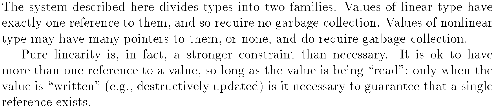

class: center, middle

# Linear Haskell

## Practical Linearity in a Higher‑Order Polymorphic Language

Presented by [Artem Pelenitsyn](http://staff.mmcs.sfedu.ru/~ulysses/), Northeastern U (artem@ccs.neu.edu)

---

## Linear Types: Why Care?

--

* Well-Typed Resource-Aware Protocols

  * Think a file handle that needs to be closed

--

* Run-time Performance

  * Linear Types Can Change the World! by _P. Wadler_ (1990)  
    

--

* Rust

---


# Linear Haskell: Challenges

* Backward Compatibility

* Reusing Existing Codebase

* Retrofitting In a “Realistic” Language

--

##  Non-Challenge

* Run-time Performance

---

# Outline

1. Haskell Prelude

2. Linear Haskell Compiler Extension (POPL '18, GHC 9.0 @ Feb 2021)

   1. Definition and interactions with other language features 
   
   2. Safe resource management

3. Linear Constraints Idea (in submission) 

4. General Q&A 

---

class: center, middle

# Haskell Prelude

---

## What is Haskell (following Haskell Report 2010)

Haskell is

1. a general-purpose, 
2. purely 
2. functional programming language 
3. featuring higher-order functions, 
4. nonstrict semantics, 
5. static polymorphic typing,
6. user-defined algebraic data types, pattern matching, 
7. a module system, 
8. a monadic I/O system, 
9. and a rich set of primitive data types (including lists,
   arrays, arbitrary- and fixed-precision integers, and floating-point numbers).

---
# Example: Lists

```haskell
-- List datatype; `a` is a type parameter, they're always lower cased
data List a =
  Nil |
  Cons a (List a) 
```
--
```haskell
-- List datatype, GADT Syntax, absolutely equivalent to the previous
data List a where   
  Nil  :: List a
  Cons :: a -> List a -> List a
```

--

```haskell
-- List concatenation function
concat :: List a -> List a -> List a -- ~ List a -> (List a -> List a)
concat Nil         ys = ys
concat (Cons x xs) ys = Cons x (concat xs ys)
```

---

# Monads

```haskell
class Monad m where        -- interface Monad
  return :: a -> m a
  (>>=)  :: forall a b. m a -> (a -> m b) -> m b
```
--

```haskell
instance Monad List where  -- implementation for List 
  return a = Cons a Nil
  
  Nil         >>= f = Nil
  (Cons a as) >>= f = concat (f a) (as >>= f) 
```
--

Do-notation
```haskell
do
  x <- a
  y <- f x      
  return (g y) -- ~ a >>= (\x -> f x >>= (\y -> return g y))
```

---

# Monads: Why Care?

Monads are known to provide a reasonable pure interface to impure operations.

```haskell
firstLine :: FilePath -> IO String
firstLine fp = do
  h  <- openFile fp
  xs <- readLine h
  closeFile h
  return xs 
```

--

`IO` is an abstract type with the following operations:

```haskell
openFile  :: FilePath -> IO Handle
readLine  :: Handle   -> IO String
closeFile :: Handle   -> IO ()
-- ...
```

---

class: center, middle

# Linear Haskell Extension

---

## Linear Extension Allows Stricter Contracts

* Does my sorting function return sensible result?<sup><small>1</small></sup>
    ```haskell
        sort :: [Int] -> SortedList Int
        -- vs.
        sort :: [Int] ⊸ SortedList Int
    ```
* Can I do in-place updates?

* Do I close my file handles?

--

  

<sup><small>1</small></sup>
[Blog post](https://www.tweag.io/blog/2018-03-08-linear-sort/) on that (it's not super easy)

---

## Linear Arrows: Conditional Consumption

`f :: s ⊸ t` means that: 

* **if** `(f u)` is _consumed_ exactly once,

* **then** the argument `u` is _consumed_ exactly once.

--

_Consume_ ::=

* To consume a **value of atomic base type** (like `Int` or `Ptr`) exactly once, just _evaluate_ it.

* To consume a **function** value exactly once, apply it to one argument, and consume its result exactly once.

* To consume a **value of an algebraic datatype** exactly once, pattern-match on it, and consume all its linear components exactly once.

---

# Example: List Concatenation

```haskell
-- List datatype
data List a where
  Nil  :: List a
  Cons :: a ⊸ List a ⊸ List a
```

--

```haskell
-- Linear concatenation function
concat :: List a ⊸ List a ⊸ List a
concat Nil         ys = ys
concat (Cons x xs) ys = Cons x (concat xs ys)
```

---

# Backward Compatability for Datatypes 

Data constructors are linear by default; previous list equivalent:

```haskell
data List1 a = Nil1 | Cons1 a (List1 a)
```

--

Same with GADTs unless both holds:

* a module turns on the `-XLinearTypes` extension and

* uses the regular arrow for one of its GADTs.

---

## Datatypes and Linearity (ctd.)

**Linear Pairs**


```haskell
f1 :: (Int, Int) -> (Int, Int)
f1 x = case x of (a, b) -> (a, a)

f2 :: (Int, Int) ⊸ (Int, Int)
f2 x = case x of (a, b) -> (b, a)

```

--

**Unrestricted Constructors**

```haskell
data Ur a where  -- Unrestricted resource
    Ur :: a -> Ur a

f3 :: (Int, Ur Int) ⊸ (Int, Int)
f3 x = case x of (a, Ur _) -> (42, a) -- is this OK?
```

---

# Interplay Between ⊸ And →

```haskell
f :: s ⊸ t
g :: s -> t
g x = f x -- is this OK?
```
--
```haskell
sum  :: [Int] ⊸ Int
(++) :: [Int] ⊸ [Int] ⊸ Int -- concatenation
f    :: [Int] ⊸ [Int] -> Int

f xs ys = sum (xs ++ ys) + sum ys   -- is this OK?
```

---

# Interplay Between ⊸ And → (contd.)

```haskell
f :: Int ⊸ Int
g :: (Int -> Int) -> Bool
h = g f -- Legal???
```
In general, do we want `⊸ <: ->`?

--

Compiler will take care of it:

```haskell
h = g f ↝  g (λx -> f x)    -- s.c. η-expansion
```

---

# Linearity for Return Types?

Old trick — use CPS (continuation passing):
```haskell
f :: A -> (B ⊸ r) ⊸ r -- effectively, `f` accepts `A` & returns linear `B`
```

--

Especially useful for monads:

```haskell
type IOL a  -- means: IO-value `a` that can only be used once

return :: a ⊸ IOL a
(>>=)  :: IO p a ⊸ (a ⊸ IOL b) ⊸ IOL b
```

--

```haskell
foo :: SomeLinearMonad a
foo = do
  linearValue <- action1
  -- ...
```


---

class: center, middle

# Safe Resource Management

---

# Unsafe In-place Mutation (pre-linear)

```haskell
array :: Int -> [(Int, a)] -> Array a
array size pairs = runST do
  ma ← newMArray size     -- create mutable array
  forM_ pairs (write ma)  -- monadic for-loop to fill it
  unsafeFreeze ma         -- turn it into immutable array -- UNSAFE!

```

--

Monadic Mutable Array Interface:
```haskell
newMArray    :: Int → ST s (MArray s a)
write        :: MArray s a → (Int, a) → ST s ()
unsafeFreeze :: MArray s a → ST s (Array a)

forM_ :: Monad m ⇒ [a] → (a → m ()) → m ()
runST :: (∀s. ST s a) → a
```

---

# Safe In-place Mutation (Linear Haskell)

```haskell
array :: Int -> [(Int, a)] -> Array a
array size pairs =
  newMArray size (λma -> freeze (foldl write ma pairs))

```

--

Linear Mutable Array Interface:
```haskell
newMArray :: Int -> (MArray a ⊸ Ur b) ⊸ b
write     :: MArray a ⊸ (Int, a) -> MArray a
freeze    :: MArray a ⊸ Ur (Array a)
```

---

# Safe File Handling

```haskell
firstLine :: FilePath -> IOL String
firstLine fp = do
  h <- openFile fp
  (h, Ur xs) <- readLine h  -- threading the handle
  closeFile h
  return xs 
```

--

```haskell
openFile  :: FilePath -> IOL Handle
readLine  :: Handle   ⊸ IOL (Handle, Ur String)
closeFile :: Handle   ⊸ IOL ()
```

---

class: center, middle

# Linear Constraints

---

# Type Classes as Implicits 

```haskell
foo :: a -> String
foo a = {- what could that be? -}
```

--

.left-half[
But with a constraint: 
```haskell
class Show a where
  show :: a -> String

showTwice :: Show a => a -> String
showTwice a = show a ++ show a
```
]
--
.right-half[
Translation (inside GHC)
```haskell
data ShowD a = ShowD {
  show :: a -> String }

showTwice' :: ShowD a -> a -> String
showTwice' d a = show d a ++ show d a
```
]

---

# Linear Constraints for IOL

.left-third[
Original Linear Haskell
```haskell
closeFile ::
  Handle ⊸ IOL ()
```
]
.right-third[
Linear Constraints
```haskell
closeFile ::
  Open h =○ Handle h -> IOL ()
```
]
--
.left-third[
```haskell
openFile ::
  FilePath -> IOL Handle
```
]
.right-third[
```haskell
openFile ::
  FilePath -> IOL (∃h. Open h =○ Ur (Handle h))
```
]
--
.left-third[
```haskell
readLine ::
  Handle ⊸
  IOL (Handle, Ur String)
```
]
.right-third[
```haskell
readLine ::
  Open h =○ Handle h ->
  IOL (Open h =○ Ur String)
```
]

---

## Safe File Handling With Linear Constraints

```haskell
firstLine :: FilePath -> IOL String
firstLine fp = do
  pack! h  <- openFile fp
  pack! xs <- readLine h
  closeFile h
  return xs
```


Interface:
```haskell
closeFile :: Open h =○ Handle h -> IOL ()
openFile  :: FilePath -> IOL (∃h. Open h =○ Ur (Handle h))
readLine  :: Open h =○ Handle h -> IOL (Open h =○ Ur String)
```

---

## References

* Linear Haskell: Practical Linearity In a Higher-Order Polymorphic Language / _J.-P. Bernardy et al._, POPL'18,
  [doi:10.1145/3158093](https://dl.acm.org/doi/10.1145/3158093)

* Linear Constraints / _J.-P. Bernardy et al._, in submission,
  [arXiv:2103.06127](https://arxiv.org/abs/2103.06127)

* Linear Types Can Change the World! / _P. Wadler_, PCM '90,
  [[PDF]](http://citeseerx.ist.psu.edu/viewdoc/download?doi=10.1.1.31.5002&rep=rep1&type=pdf)
  
* How to make ad-hoc polymorphism less ad hoc / P. Wadler, S. Blott, POPL '89,
  [doi:10.1145/75277.75283](https://dl.acm.org/doi/10.1145/75277.75283)


---

class: center, middle
count: false

# Backup

---
count: false


---
count: false

# Multiplicity Polymorphism

Is `map` of `(a ⊸ b) -> [a] ⊸ [b]` or of `(a -> b) -> [a] -> [b]`?

--

Neither. It is:

```haskell
map :: ∀{p} a b. (a %p -> b) -> [a] %p -> [b]
```

--

Abbreviate as follows:


* `a ⊸ b` ::= `a %1 -> b`

* `a -> b` ::= `a %Many -> b`

Thus, there are two concrete multiplicities: `1` and `Many`.

---
count: false

# Quiz: Typing Function Composition

```haskell
(◦) :: ∀{p} {q}.
  (b %p -> c) %1 ->
  (a %q -> b) %p ->
  a           %? ->      -- what's `?`?
  c
  
(f ◦ g) x = f (g x)
```
---

count: false

# Quiz: Typing Function Composition

```haskell
(◦) :: ∀{p} {q}.
  (b %p -> c) %1 ->
  (a %q -> b) %p ->
  a           %{p·q} ->
  c
  
(f ◦ g) x = f (g x)
```

---

count: false

# Threats To Validity

* Huge overhaul: change the whole `base`, also modification of GHC Core

* Retrofitting still not completely thought of

    * GHC Proposals process is staling
    
    * Multiplicity 0 is already dropped

* Type inference is not formally developed

* Generally, elaboration of LH to $\lambda_{\to}^q$ (or GHC Core) is not 100% clear

---

count: false

# On the bright side

* A lot of work has been done.

--

* Efficiency could be worked out?

    * some reported in the paper (ad-hoc);
    
    * some of «cardinality&nbsp;analysis» subsumed by multiplicity annotations
    (good for inling: e.g. don't inline `(λx -> x ++ x) expensive`).

--

* Many applications in mind:

    * network-communication with 0 allocations,
    * GC-less, manual allocations,
    * resource-safe I/O,
    * safe API for the `streaming` library,
    * DSL for “printable” 3D-models.

---

count: false

# Linear Arrows vs Linear Kinds 


.right[(or: Girard was right in the first place)]

--

- Strictness & Divergence

.left-half[
```haskell
f :: a ⊸ (a, Bool)
f x = (x, True)
```
]
.right-half[
``` haskell
g :: [Int] ⊸ [Int]
g xs = repeat 1 ++ xs
```
]

- Exceptions

- Single type universe

- Can play nicely with dependent function types too as shown by Idris 2.


